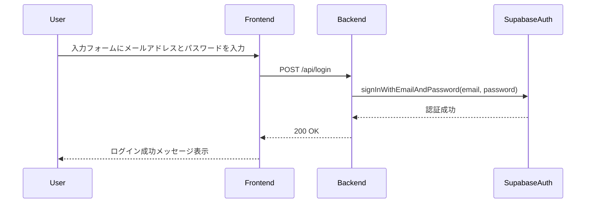
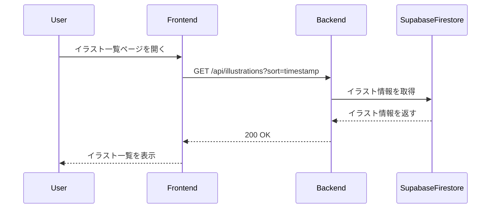
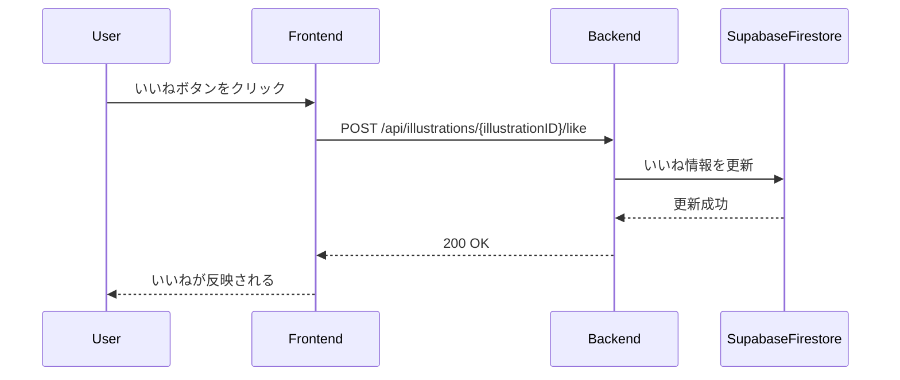

# CAC-image-post（仮）

## 詳細設計書
```
作成者: 朝倉滉人
作成日: 2025年2月2日 更新日: 2025年2月24日
```

- [フロントエンド詳細設計](#フロントエンド詳細設計)
- [バックエンド詳細設計](#バックエンド詳細設計)
    - [ユーザ登録](#ユーザ登録)
    - [ログイン](#ログイン)
    - [ログアウト](#ログアウト)
    - [イラスト投稿](#イラスト投稿)
    - [イラスト取得](#イラスト取得)
    - [各ユーザのイラスト取得](#各ユーザのイラスト取得)
    - [イラスト削除](#イラスト削除)
    - [イラスト編集](#イラスト編集)
    - [いいね追加](#いいね追加)
    - [コメント追加](#コメント追加)
    - [コメント取得](#コメント取得)
- [シーケンス図](#シーケンス図)
    - [ユーザ登録シーケンス図](#ユーザ登録シーケンス図)
    - [ログインシーケンス図](#ログインシーケンス図)
    - [イラスト投稿シーケンス図](#イラスト投稿シーケンス図)
    - [イラスト取得シーケンス図](#イラスト取得シーケンス図)
    - [いいね追加シーケンス図](#いいね追加シーケンス図)
- [画面設計図](#画面設計図)
- [データベース設計](#データベース設計)

### フロントエンド詳細設計

あああ

### バックエンド詳細設計

#### ユーザ登録

```
エンドポイント   : /api/register
HTTPメソッド    : POST
リクエストボディ :
{
  "email": "user@university.edu",
  "password": "password123"
}
レスポンス      : 成功: 201、失敗: 400
```

#### ログイン

```
エンドポイント   : /api/login
HTTPメソッド    : POST
リクエストボディ :
{
  "email": "user@university.edu",
  "password": "password123"
}
レスポンス      : 成功: 201、失敗: 400
```

#### ログアウト

```
エンドポイント   : /api/logout
HTTPメソッド    : POST
レスポンス      : 成功: 200
```

#### イラスト投稿

```
エンドポイント   : /api/illustrations
HTTPメソッド    : POST
リクエストボディ :
{
  "image": "base64encodedimage",
  "title": "Illustration Title",
  "userId": "user123",
  "caption": "This is a caption",
  "ageRestriction": "18+",
  "tags": ["tag1", "tag2"],
  "timestamp": "2025-02-02T18:50:14Z"
}
レスポンス      : 成功: 201、失敗: 400
```

#### イラスト取得

```
エンドポイント   : /api/illustrations
HTTPメソッド    : GET
クエリパラメータ : sort: timestamp | tags | username
レスポンス      : 成功: 200、失敗: 400
```

#### 各ユーザのイラスト取得

```
エンドポイント   : /api/user/{userID}/illustrations
HTTPメソッド    : GET
レスポンス      : 成功: 200、失敗: 400
```

#### イラスト削除

```
エンドポイント   : /api/illustrations/{illustrationID}
HTTPメソッド    : DELETE
レスポンス      : 成功: 200、失敗: 400
```

#### イラスト編集

```
エンドポイント   : /api/illustrations/{illustrationID}
HTTPメソッド    : PUT
リクエストボディ :
{
  "title": "Updated Title",
  "caption": "Updated Caption",
  "ageRestriction": "18+",
  "tags": ["updatedTag1", "updatedTag2"]
}
レスポンス      : 成功: 200、失敗: 400
```

#### いいね追加

```
エンドポイント   : /api/illustrations/{illustrationID}/like
HTTPメソッド    : POST
レスポンス      : 成功: 200、失敗: 400
```

#### コメント追加

```
エンドポイント   : /api/illustrations/{illustrationID}/comments
HTTPメソッド    : POST
リクエストボディ :
{
  "userId": "user123",
  "comment": "This is a comment",
  "timestamp": "2025-02-02T18:50:14Z"
}
レスポンス      : 成功: 200、失敗: 400
```

#### コメント取得

```
エンドポイント   : /api/illustrations/{illustrationID}/comments
HTTPメソッド    : GET
レスポンス      : 成功: 200、失敗: 400
```

### シーケンス図

#### ユーザ登録シーケンス図


#### ログインシーケンス図



#### イラスト投稿シーケンス図


#### イラスト取得シーケンス図



#### いいね追加シーケンス図




### 画面設計図

``` mermaid
```

### データベース設計

#### usersテーブル
- 役割：ユーザー情報の管理、Supabaseの認証機能と連携
- 内容
    - id：ユーザID
    - username：ユーザ名
    - avatar_url：アバター画像
    - bio：自己紹介文
    - created_at：作成日
    - updated_at：更新日

#### postsテーブル
- 役割：投稿情報の管理、画像URLやキャプション等を保存
- 内容
    - id：画像ID
    - user_id：ユーザID（users）
    - image_url：画像のURL
    - caption：説明文
    - created_at：作成日
    - updated_at：更新日

#### likesテーブル
- いいね機能の管理、ユーザーと投稿の関連付け
- 内容
    - id：いいねID
    - post_id：画像ID（posts）
    - user_id：ユーザID（users）
    - created_at：作成日
    - UNIQUE(post_id, user_id)

#### commentsテーブル
- コメント機能の管理
- 内容
    - id：コメントID
    - post_id：画像ID（posts）
    - user_id：ユーザID（users）
    - context：コメント内容
    - created_at：作成日
    - updated_at：更新日

``` mermaid
erDiagram
    USERS {
        int id PK
        string username
        string avatar_url
        string bio
        datetime created_at
        datetime updated_at
    }
    POSTS {
        int id PK
        int user_id FK
        string image_url
        string caption
        datetime created_at
        datetime updated_at
    }
    LIKES {
        int id PK
        int post_id FK
        int user_id FK
        datetime created_at
    }
    COMMENTS {
        int id PK
        int post_id FK
        int user_id FK
        string context
        datetime created_at
        datetime updated_at
    }

    USERS ||--o{ POSTS : "has" 
    USERS ||--o{ LIKES : "gives"
    USERS ||--o{ COMMENTS : "writes"
    POSTS ||--o{ LIKES : "receives"
    POSTS ||--o{ COMMENTS : "has"
```
