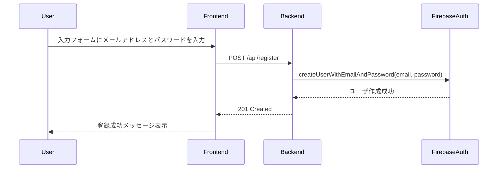
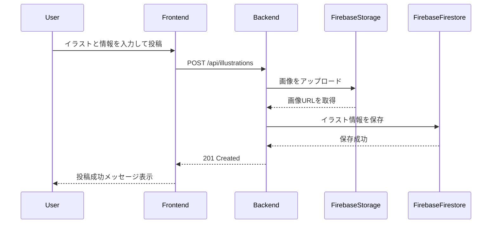

# CAC-image-post（仮）

## 詳細設計書
```
作成者: 朝倉滉人
作成日: 2025年2月2日　更新日: 2025年2月2日
```

- [フロントエンド詳細設計](#フロントエンド詳細設計)
- [バックエンド詳細設計](#バックエンド詳細設計)
    - [ユーザ登録](#ユーザ登録)
    - [ログイン](#ログイン)
    - [ログアウト](#ログアウト)
    - [イラスト投稿](#イラスト投稿)
    - [イラスト取得](#イラスト取得)
    - [各ユーザのイラスト取得](#各ユーザのイラスト取得)
    - [イラスト削除](#イラスト削除)
    - [イラスト編集](#イラスト編集)
    - [いいね追加](#いいね追加)
    - [コメント追加](#コメント追加)
    - [コメント取得](#コメント取得)
- [シーケンス図](#シーケンス図)
    - [ユーザ登録シーケンス図](#ユーザ登録シーケンス図)
    - [ログインシーケンス図](#ログインシーケンス図)
    - [イラスト投稿シーケンス図](#イラスト投稿シーケンス図)
    - [イラスト取得シーケンス図](#イラスト取得シーケンス図)
    - [いいね追加シーケンス図](#いいね追加シーケンス図)
- [画面設計図](#画面設計図)
- [データベース設計](#シーケンス図)

### フロントエンド詳細設計

あああ

###　バックエンド詳細設計

#### ユーザ登録

```
エンドポイント   : /api/register
HTTPメソッド    : POST
リクエストボディ :
{
  "email": "user@university.edu",
  "password": "password123"
}
レスポンス      : 成功: 201、失敗: 400
```

#### ログイン

```
エンドポイント   : /api/login
HTTPメソッド    : POST
リクエストボディ :
{
  "email": "user@university.edu",
  "password": "password123"
}
レスポンス      : 成功: 201、失敗: 400
```

#### ログアウト

```
エンドポイント   : /api/logout
HTTPメソッド    : POST
レスポンス      : 成功: 200
```

#### イラスト投稿

```
エンドポイント   : /api/illustrations
HTTPメソッド    : POST
リクエストボディ :
{
  "image": "base64encodedimage",
  "title": "Illustration Title",
  "userId": "user123",
  "caption": "This is a caption",
  "ageRestriction": "18+",
  "tags": ["tag1", "tag2"],
  "timestamp": "2025-02-02T18:50:14Z"
}
レスポンス      : 成功: 201、失敗: 400
```

#### イラスト取得

```
エンドポイント   : /api/illustrations
HTTPメソッド    : GET
クエリパラメータ : sort: timestamp | tags | username
レスポンス      : 成功: 200、失敗: 400
```

#### 各ユーザのイラスト取得

```
エンドポイント   : /api/user/{userID}/illustrations
HTTPメソッド    : GET
レスポンス      : 成功: 200、失敗: 400
```

#### イラスト削除

```
エンドポイント   : /api/illustrations/{illustrationID}
HTTPメソッド    : DELETE
レスポンス      : 成功: 200、失敗: 400
```

#### イラスト編集

```
エンドポイント   : /api/illustrations/{illustrationID}
HTTPメソッド    : PUT
リクエストボディ :
{
  "title": "Updated Title",
  "caption": "Updated Caption",
  "ageRestriction": "18+",
  "tags": ["updatedTag1", "updatedTag2"]
}
レスポンス      : 成功: 200、失敗: 400
```

#### いいね追加

```
エンドポイント   : /api/illustrations/{illustrationID}/like
HTTPメソッド    : POST
レスポンス      : 成功: 200、失敗: 400
```

#### コメント追加

```
エンドポイント   : /api/illustrations/{illustrationID}/comments
HTTPメソッド    : POST
リクエストボディ :
{
  "userId": "user123",
  "comment": "This is a comment",
  "timestamp": "2025-02-02T18:50:14Z"
}
レスポンス      : 成功: 200、失敗: 400
```

#### コメント取得

```
エンドポイント   : /api/illustrations/{illustrationID}/comments
HTTPメソッド    : GET
レスポンス      : 成功: 200、失敗: 400
```

### シーケンス図

#### ユーザ登録シーケンス図



#### ログインシーケンス図


#### イラスト投稿シーケンス図



#### イラスト取得シーケンス図


#### いいね追加シーケンス図


### 画面設計図

``` mermaid
```

### データベース設計

``` mermaid
```
